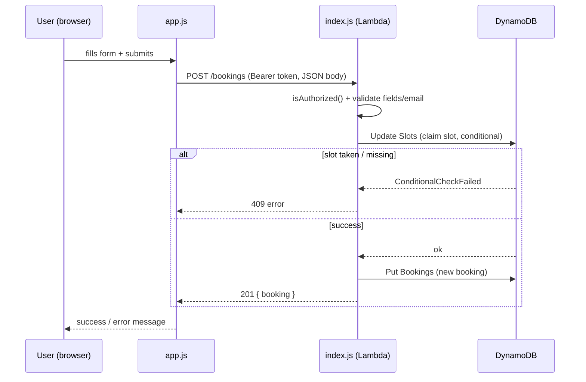

```mermaid
sequenceDiagram
    participant U as User (browser)
    participant F as app.js
    participant L as index.js (Lambda)
    participant D as DynamoDB

    U->>F: fills form + submits
    F->>L: POST /bookings (Bearer token, JSON body)
    L->>L: isAuthorized() + validate fields/email
    L->>D: Update Slots (claim slot, conditional)
    alt slot taken / missing
        D-->>L: ConditionalCheckFailed
        L-->>F: 409 error
    else success
        D-->>L: ok
        L->>D: Put Bookings (new booking)
        L-->>F: 201 { booking }
    end
    F-->>U: success / error message
```